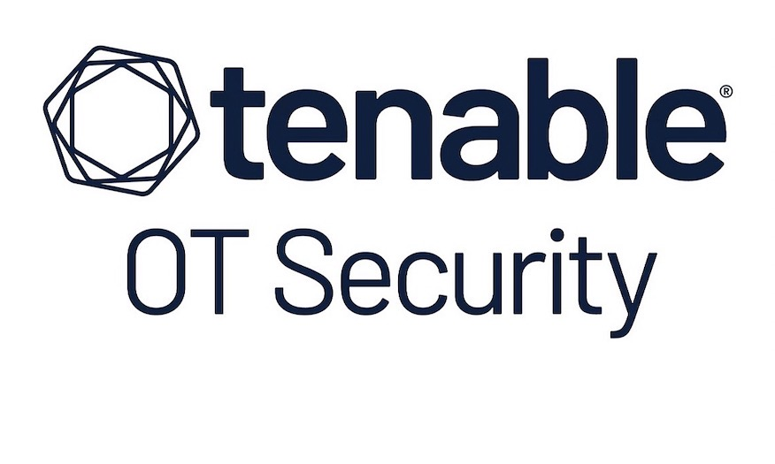

# Tenable-OT-Exposure-Utilities
Tenable OT Exposure Utilities

- Tenable OT Exposure is a very complex solution with leftover components from Indegy ICS 
- Compared to other OT Solutions from licensing to physical hardware to being able to extract the information due to limited export capabilities via .json, .csv, .pdf. or PowerBI, it does NOT have a focus on Enterprise Grade versus smaller organizations.
- It requires months of testing versus 30-60 days 

⚠️ Disclaimer

## NO SIMPLE QUICKSTART

There is NO simple Quickstart as advertised regarding up and running in less than 5 days in an Enterprise grade environment. 

There is shipping of actual physical hardware, there are network placement requests, placing the physical appliances at the correct location.

30+ step for configuration for each physical appliance, more for virtual

Quickstart OT effort does not include API testing at all, which makes it much more complex on Enterprises are evaluating OT/IOT Enterprise grade solutions without the following:

- A documented Requirements Traceability Matrix Document
- Granular Example Use Case Document
- Pre-defined granular project plan
- User Documentation Review
- Installation Review
- Initial Setup Review
- 'official' defect tracker
- High Level Testing Document
- High Level Executive Presentation
- Detailed Testing Document
- Detailed Report

---

⚠️ Disclaimer

Use of this package are not covered by any license, warranty, or support agreement you may have with Tenable.
All functionality is implemented independently using publicly available Tenable OT Exposure API documentation.

# 🏭 Tenable OT GraphQL Exporter

## Overview
Enterprise-grade GraphQL query framework for **Tenable OT Exposure**.  
Designed to extract, paginate, and export **OT assets, events, sensors, policies, users, and operational telemetry** using Tenable OT Exposure's native GraphQL API

---

## 🚀 Key Capabilities

### 🧠 OT Asset Intelligence
| Feature | Description |
|------|-------------|
| 🏗️ Asset Inventory | Full OT asset extraction including type, vendor, firmware, serial, OS, Purdue level |
| 🧬 Asset Classification | Asset types, categories, roles, safety-rated flags |
| 🌐 Network Context | IPs, MACs, VLANs, segments, zones |
| 🧱 Purdue Model Mapping | Native Purdue level support (L0–L5) |
| ⏱️ Lifecycle Visibility | First seen, last seen, update timestamps |
| 🧾 Revision Tracking | Asset revisions and configuration changes |

---

### 🔍 Detection & Risk Analytics
| Feature | Description |
|------|-------------|
| 🚨 OT Events | Security, policy, and operational events |
| 📊 Aggregated Event Metrics | 24h / 7d / 30d event aggregation |
| ⚠️ Severity & Category | Event severity, family, category, protocol |
| 🧩 Policy Context | Event-to-policy attribution |
| 🔄 Continuous vs Snapshot | Supports both continuous and snapshot detections |

---

### 🛡️ Vulnerability & Plugin Intelligence
| Feature | Description |
|------|-------------|
| 🔌 OT Plugins | Plugin metadata, source, family, severity |
| 📈 Risk Metrics | VPR, CVSS, unresolved events |
| 🧠 Asset Enrichment | Extended plugin details and references |
| 🔗 Asset Impact | Plugin-to-asset relationships |

---

### 🛰️ Sensor & Infrastructure Health
| Feature | Description |
|------|-------------|
| 📡 ICP Sensor Status | Sensor connectivity, health, last seen |
| 🧭 Sensor Types | Component and protocol-specific sensors |
| 🧪 BACnet & OT Protocol Visibility | BACnet object types, protocol metadata |
| 🕒 Telemetry Timelines | Time-based operational metrics |

---

### 👥 User & Access Intelligence
| Feature | Description |
|------|-------------|
| 👤 Users | User accounts and roles |
| 🔑 Authentication Validation | GraphQL-based API key verification |
| 🧾 User Activity | Action types, policy interactions |
| 🔍 User Visibility | User-driven operational actions |

---

## 📊 Supported GraphQL Domains

The exporter includes validated GraphQL coverage for:

- Assets
- Asset Fields
- Asset Types
- Asset Categories
- Events
- Event Policies
- Action Types
- Plugins
- Plugin Details
- Sensor Status
- ICP Sensor Fields
- BACnet Object Types
- Component Types
- Purdue Levels
- Core OS Versions
- Users
- System Logs

Each component is implemented as a **standalone, paginated GraphQL query** aligned with Tenable OT Exposure documentation.

---

## 🧱 Architecture Highlights

| Component | Purpose |
|--------|--------|
| 🧠 GraphQL Templates | Schema-aligned queries |
| 🔁 Pagination Engine | Cursor-based extraction |
| 🧪 Validation Layer | API key and permission validation |
| 📦 Export Formats | JSON and CSV ready |
| ⏱️ Rate Control | Retry, backoff, and timeout discipline |
| 🧯 Error Normalization | Structured failure events |

---

## 🎯 Design Principles

- ✅ **Schema-First** – Queries align exactly with Tenable OT Exposure documentation 
- 🔒 **Safe by Default** – Read-only GraphQL operations only  
- 🧪 **Validated** – Designed to run in GraphiQL Playground  
- 🧩 **Composable** – Each query stands alone  

---

## 🧪 Validation & Testing

- Tested using Tenable OT Exposure **GraphiQL Playground**
- Supports cursor-based pagination
- Handles empty result sets gracefully
- Validates API access before extraction

---

## 🏗️ Intended Use Cases

- OT Asset Inventory Export
- Sensor Health Auditing
- OT Event Analysis
- Vulnerability & Plugin Risk Analysis
- IoT/OT discovery, identification, classification mapping based on multiple asset attributes not IP address
- SIEM / Data Lake Ingestion (tool-agnostic)

---

## 📚 References

- Tenable OT Exposure GraphQL Playground  
  https://developer.tenable.com/docs/ot-graphiql-playground

- Tenable OT Exposure API Documentation  
  https://docs.tenable.com/OT-security/api/

---
# License

#MIT License

#Copyright (c) 2025-2026 TruSecure, LLC - 
Developers: Mark Teicher/David Scott Bird

Permission is hereby granted, free of charge, to any person obtaining a copy
of this software and associated documentation files (the "Software"), to deal
in the Software without restriction, including without limitation the rights
to use, copy, modify, merge, publish, distribute, sublicense, and/or sell
copies of the Software, and to permit persons to whom the Software is
furnished to do so, subject to the following conditions:

The above copyright notice and this permission notice shall be included in all
copies or substantial portions of the Software.

THE SOFTWARE IS PROVIDED "AS IS", WITHOUT WARRANTY OF ANY KIND, EXPRESS OR
IMPLIED, INCLUDING BUT NOT LIMITED TO THE WARRANTIES OF MERCHANTABILITY,
FITNESS FOR A PARTICULAR PURPOSE AND NONINFRINGEMENT. IN NO EVENT SHALL THE
AUTHORS OR COPYRIGHT HOLDERS BE LIABLE FOR ANY CLAIM, DAMAGES OR OTHER
LIABILITY, WHETHER IN AN ACTION OF CONTRACT, TORT OR OTHERWISE, ARISING FROM,
OUT OF OR IN CONNECTION WITH THE SOFTWARE OR THE USE OR OTHER DEALINGS IN THE
SOFTWARE.
	
